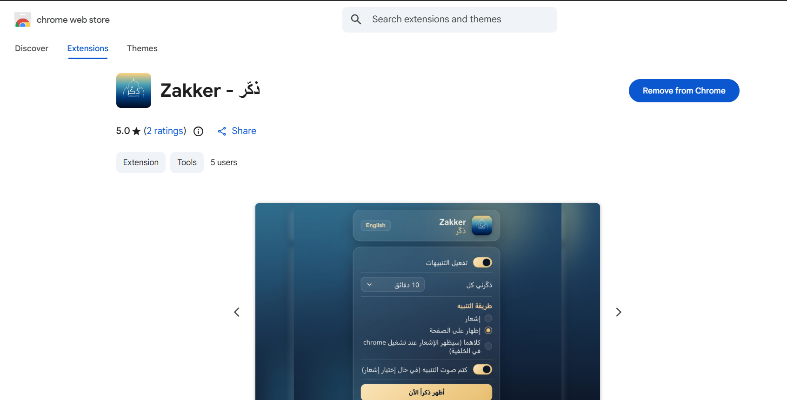

<p align="center">
  
</p>

<h1 align="center">Zakker — ذكّر</h1>

<p align="center">
  A lightweight Chrome extension that gently reminds you to perform <em>zikr</em> (Islamic remembrance of Allah) while you browse.
</p>

<p align="center">
  
  
  
</p>

<p align="center">
  
</p>

## Overview

Zakker runs quietly in the background and surfaces a short zikr — such as *"سبحان اللَّه"* or *"الحمد للَّه"* — at an interval you choose, so a moment of remembrance stays part of your day even during long browsing sessions. It shows up either as a native Chrome notification, a subtle in-page overlay card, or both.

## Features

- 🔔 **Periodic reminders** — pick a preset interval (10 min, 30 min, 1h, 2h, 3h) or set a custom one
- 🕌 **Curated azkar** — 26 short, authentic azkar shown in a shuffled, non-repeating rotation
- 🖥️ **Two display modes** — a system notification, an unobtrusive on-page overlay, or both (overlay when Chrome is focused, notification when it isn't)
- 🔇 **Mute notification sound** — for a fully silent experience
- ⚡ **"Show a zikr now"** — get a reminder on demand from the popup
- 🌐 **Bilingual UI** — Arabic and English, with automatic RTL/LTR layout
- 🔒 **No tracking, no network calls** — everything runs and stays on your device

## Installation

### From source (developer mode)

1. Clone or download this repository.
   ```bash
   git clone https://github.com/Hatem-H-Mohamed/zakker_extension
   ```
2. Open `chrome://extensions` in Chrome.
3. Enable **Developer mode** (top-right toggle).
4. Click **Load unpacked** and select the `zakker_extension` folder.
5. Pin the Zakker icon to your toolbar and you're set.

### Chrome Web Store

https://chromewebstore.google.com/detail/zakker-%D8%B0%D9%83%D9%91%D8%B1/mpmdoggkllogkkicjmhplinhkbiicebm

## Usage

1. Click the Zakker toolbar icon to open the popup.
2. Toggle **Enable reminders** on or off.
3. Choose how often you'd like to be reminded.
4. Choose how reminders should be shown: **Notification**, **Page overlay**, or **Both**.
5. Optionally mute the notification sound.
6. Use **Show a zikr now** any time you want an immediate reminder.

Settings sync across your signed-in Chrome browsers via `chrome.storage.sync`.

## How it works

- A `chrome.alarms` timer fires at your configured interval and triggers `background.js`, the extension's service worker.
- Azkar are loaded from `daily_azkar.json`, shuffled, and served one at a time from a queue that reshuffles once exhausted — so you see every entry before any repeats.
- Depending on your display mode, the background script either raises a `chrome.notifications` alert or messages the active tab's content script (`content.js`) to render an animated overlay card that auto-dismisses after a few seconds.

## Project structure

```
zakker_extension/
├── manifest.json          # Extension manifest (Manifest V3)
├── background.js          # Service worker: alarms, scheduling, notifications
├── content.js              # Injected script that renders the overlay card
├── content.css             # Overlay card styling
├── popup.html / popup.js / popup.css   # Settings popup UI
├── daily_azkar.json        # The list of azkar shown to the user
├── _locales/                # English & Arabic UI translations
│   ├── en/messages.json
│   └── ar/messages.json
├── icons/                   # Extension icons & logo
└── PRIVACY_POLICY.md        # Privacy policy
```

## Permissions

| Permission | Why it's needed |
|---|---|
| `alarms` | Schedule periodic reminders locally |
| `notifications` | Show system notifications |
| `storage` | Save your settings locally (and sync them via your Google account) |
| `<all_urls>` (host permission) | Allow the overlay card to be injected on any page you're browsing |

## Privacy

Zakker collects **zero** data. No analytics, no network requests, no third-party services. All settings live entirely in Chrome's local/sync storage on your own device. See [`PRIVACY_POLICY.md`](PRIVACY_POLICY.md) for the full policy.

## Contributing

Issues and pull requests are welcome — whether it's a bug fix, a UI improvement, additional translations, or more azkar entries in `daily_azkar.json`.

## Contact

Questions or feedback: **hatem.hatem.mo1@gmail.com**
